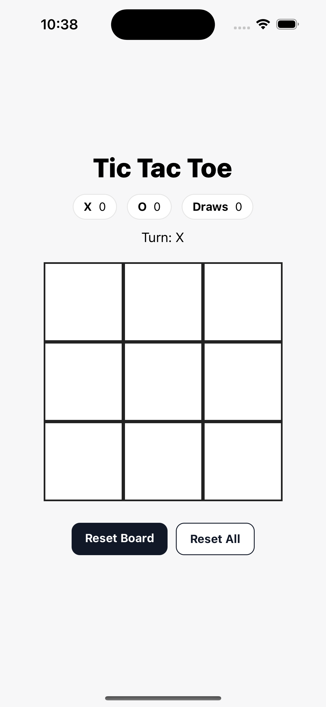

# React Native Tic-Tac-Toe

A simple Tic-Tac-Toe game built using React Native and Expo.  
This project demonstrates my skills in mobile UI development, state management, and handling basic game logic.  


## Features

- Playable 2-player mode
- Clear and responsive UI
- Built with Expo and React Native

## Installation

1. Clone the repository:

   ```bash
   git clone https://github.com/miatresenio/tictactoe-rn-expo.git
   
   ```

   Navigate to the project folder:
   cd tictactoe

   Install dependencies:
   npm install

   Run the app:
   npx expo start

## Screenshots




## Developer

Developed by Mia Myca Tresenio


## License

This project is licensed under the [MIT License](./LICENSE).
